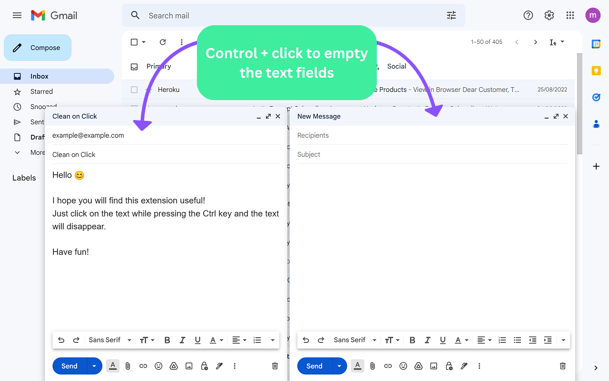

# Clean on click

This Chrome extension will **clean any text field** from its content if you click on it while pressing the Ctrl button. 

 

  

 

NOTE: 
- The extension does not work on the New Tab page (the page that opens when you click on the + sign in Chrome). This is standard behaviour for all extensions.
- The extension does not work on pages whose URL starts with the word "chrome", for example chrome://extensions/ or chrome://settings/.
  
&nbsp;  

### Stack used:

HTML, CSS, Javascript (Extensions APIs)

&nbsp;
  
### Install here: 

